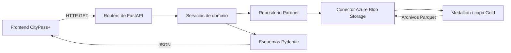

# Arquitectura y flujo de datos

## Responsabilidad del servicio

Este repositorio es la capa HTTP del módulo de analítica. No genera ni transforma
la capa Medallion: consume datasets agregados que ya existen en la capa Gold y
los publica con contratos JSON validados por Pydantic.

## Capas del código

| Ruta | Responsabilidad |
| --- | --- |
| `app/main.py` | Crea la aplicación, configura CORS y registra los routers. |
| `app/core/` | Lee y valida la configuración del entorno. |
| `app/routers/` | Define los endpoints HTTP y sus modelos de respuesta. |
| `app/services/` | Selecciona cada dataset y convierte sus filas al contrato de salida. |
| `app/repositories/` | Abstrae el listado y la lectura de archivos Parquet. |
| `app/storage/` | Encapsula el cliente de Azure Blob Storage. |
| `app/schemas/` | Define los contratos Pydantic expuestos por la API. |
| `test/` | Contiene pruebas unitarias, HTTP y de integración con Azure. |

## Datasets Gold consumidos

| Dominio | Blob dentro del contenedor Gold |
| --- | --- |
| Reclamos | `Reclamos/reclamos_resumen.parquet` |
| Seguridad y emergencias | `Emergencias y Seguridad/emergencias_resumen.parquet` |
| Movilidad urbana | `Movilidad Urbana/viajes_resumen.parquet` |
| Espacios públicos y cultura | `Espacios Publicos y Cultura/reservas_resumen.parquet` |
| Residuos | `Gestion de Residuos Inteligente/alertas_resumen.parquet` |

El endpoint de eventos es temporal y devuelve un objeto de prueba; todavía no
consume un dataset Gold.

## Ciclo de una consulta

1. FastAPI resuelve la dependencia `obtener_repositorio`.
2. La configuración de Azure se carga desde variables de entorno.
3. Se abre un `ContainerClient` para el contenedor Gold.
4. El servicio descarga el Parquet correspondiente y Polars lo lee en memoria.
5. Cada fila se valida contra su esquema Pydantic.
6. FastAPI serializa la lista resultante como JSON y cierra el cliente de Azure.

Actualmente no existe caché: cada consulta de analítica vuelve a descargar su
archivo. Tampoco existe una base de datos propia en este servicio.
